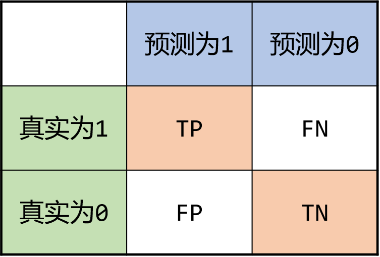

# Lecture3 二分类简介

# 主要内容

- nbextensions

> pip install jupyter_contrib_nbextensions
>
> jupyter contrib nbextension install --user
>
> jupyter nbextension enable codefolding/main

- pandas merge groupby
- 二分类评价指标
- svm原理
- 数据竞赛

# 二分类评价指标

## 准确率

局限性，样本不平衡的时候不科学

$$
准确率 = \frac{预测正确的样本数}{样本总数}
$$
## 混淆矩阵

精确率(precision)
$$
precision = \frac{TP}{TP+FP}
$$
召回率(recall)
$$
recall = \frac{TP}{TP+FN}
$$
F1-score
$$
F1 = \frac{2*precision\times recall}{precision+recall}
$$

# 思考

- DataFrame多列如何map
- transform 和 apply的区别